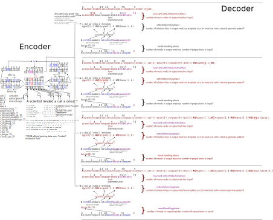

## RASP-for-ReCOGS_pos 

**UPDATE (2025-04-22)**: Preprint is up on arXiv: https://arxiv.org/abs/2504.15349 !

This repo contains a [paper in progress](https://raw.githubusercontent.com/willy-b/RASP-for-ReCOGS/main/rasp-for-recogs_pos-wbruns-2024-draft.pdf)

describing a Restricted Access Sequence Processing language model which performs the ReCOGS_pos task (see Wu et al 2023, "ReCOGS: How Incidental Details of a Logical Form Overshadow an Evaluation of Semantic Interpretation", https://arxiv.org/abs/2303.13716 for task description) of translating sentences in a limited subset of English grammar into logical forms (equivalent to a semantic graph, see ReCOGS and COGS papers). This work is an attempt to prove-by-construction that a Transformer can learn to perform the ReCOGS_pos task in a compositional, systematic, length generalizing way and try to understand why some of the specific errors discussed by Wu et al 2023 are observed. We achieve 100% test set Semantic Exact Match accuracy using a flat, non-tree Transformer compatible RASP model. It uses 19 Transformer attention-head compatible grammar pattern recognizers plus some general attention-head compatible prepositional phrase/complement phrase handling rules (which handle phrase recursion using the decoder loop), and also gets high scores on the generalization splits [(see paper)](https://raw.githubusercontent.com/willy-b/RASP-for-ReCOGS/main/rasp-for-recogs_pos-wbruns-2024-draft.pdf). We predict some details of errors made by Wu et al 2023's Transformer on the previously reported most difficult split obj-pp-to-subj-pp, and successfully predict a new generalization split that is as hard as the obj-pp-to-subj-pp split.

What is Restricted Access Sequence Processing (RASP)? It is a language that can be compiled to Transformer weights, designed to help one in "Thinking Like Transformers" (title of Weiss et al 2021 paper, https://arxiv.org/abs/2106.06981 ,  which introduced it).

The code for the project that this paper describes the results of is available MIT-licensed in the https://github.com/willy-b/learning-rasp repository ( recogs_examples_in_rasp.py and word-level-pos-tokens-recogs-style-decoder-loop.rasp , specifically, see also the README, noting that some other RASP programs are also there ).

Figure 1 from paper (vector graphics used in paper, raster above).
The task we solve is to extract the meaning (c) written in format (iii) of sentences (i). Full description of Figure (in higher quality vector graphics as well) is in the paper.

### Full Abstract

Humans rapidly generalize from a few observed examples and understand new combinations of words encountered if they are combinations of words recognized from different contexts, an ability called Compositional Generalization. Some observations contradict that Transformers learn systematic, compositional solutions to problems that generalize. The COGS benchmark (Kim and Linzen 2020) reports zero percent accuracy for Transformer models on some structural generalization tasks.

We use (Weiss 2021)'s Restricted Access Sequence Processing (RASP), a Transformer-equivalent programming language, to prove by construction that a Transformer encoder-decoder can perform ReCOGS (Wu 2023) systematically and compositionally while being flat and non-recursive/non-tree. 

Our RASP model attains 100% semantic exact match and 100% string exact match on the ReCOGS test set and 100% semantic exact match on all generalization set splits except obj\_pp\_to\_subj\_pp which gets 92%.

Our RASP implementation suggests the reported "hardest split" obj-pp-to-subj-pp generalization in COGS may be a specific case of a general difficulty with ignoring prepositional-phrase-noun-phrases which are inserted in between two parts of speech with a relationship when the modified part-of-speech in the pair is on the left-side, predicting 96\% of a certain category of error (Wu 2023)'s baseline model makes on the split, and guides us to try testing the model on modifying recipient nouns on the right side of the verb in the v\_dat\_p2 form, on which the baseline Transformer performs similarly poorly on as predicted. 

The difficulty with the `np v\_dat\_p2 np\_det pp np np` modification and the previously reported subj pp modification difficulty are claimed by us to be incompatible with the Transformer learning a tree-based approach (which combines nonterminals as in `np\_det pp np -> np\_pp -> np`), so we also check (Csordas 2022)'s hypothesis that the number of Transformer layers should be at least the depth of the parse tree for a tree based solution and find no performance benefit to a couple of additional layers (beyond baseline of 2). 

Implementing our task in Restricted Access Sequence Processing immediately helped us discover additional related failure modes of the baseline Encoder-Decoder Transformer, predict the details of the errors in the logical forms (what the mismatched index in the agent when the agent is on the left of the verb would be, 96% of the time) generated for the previously reported most difficult split, and may help us reason about why a model like (Wu 2023) works with 2 layers for the ReCOGS task (compared with e.g. use of 24-layer BERT for NLP tasks in (Tenney et al 2019)).

Example RASP model flat grammar pattern matching case (np v_dat_p2 np np):

(noting that this is showing the Bidirectional Encoder of an Encoder-Decoder Transformer equivalent model, 
so it is not causal, unlike the Decoder)

Example RASP model flat grammar pattern matching case despite pp modification of middle recipient noun (np v_dat_p2 np np):

Example RASP model same flat grammar pattern non-matching case:

(noting that this is showing the Bidirectional Encoder of an Encoder-Decoder Transformer equivalent model, 
so it is not causal, unlike the Decoder)

New difficult generalization split v_dat_p2 recipient pp modification predicted and confirmed as difficult as previously reported most difficult generalization split for baseline Encoder-Decoder Transformers trained from scratch:

### References

[See paper](https://raw.githubusercontent.com/willy-b/RASP-for-ReCOGS/main/rasp-for-recogs_pos-wbruns-2024-draft.pdf) for bibliography.

### Background

Note this work derives from a final project done for Stanford's excellent XCS224U class ( https://digitalcredential.stanford.edu/check/24288227F20DD8486799B5FF5E8C04CB440129EC0DE44FEB65C4BAFABDBAA68BQWtzR2p1TG45dHowNWg5dXp6UW1kNmdYVVExekNJa1V3R2J5aFdhWi9Lb01MakFZ ).

You can find out more about the content of that course and the Stanford AI Professional Program by visiting the links provided on the certificate above or visiting the professor's excellent public course repository at https://github.com/cgpotts/cs224u (no endorsement from the professor implied by linking to them).

### Related

(NEW 2025-03-15) See also the RASP-for-COGS project (just started gen/test evaluations on 2025-03-23) at https://github.com/willy-b/RASP-for-COGS , for the original Kim and Linzen 2020 task format where structural generalizations are even harder for Transformers than in ReCOGS and Exact Match instead of Semantic Exact Match is used everywhere.
